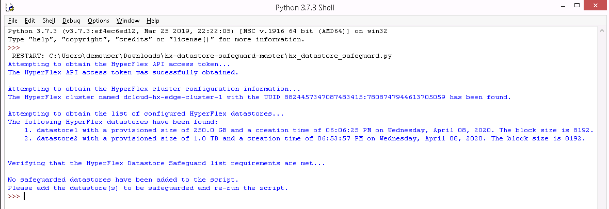
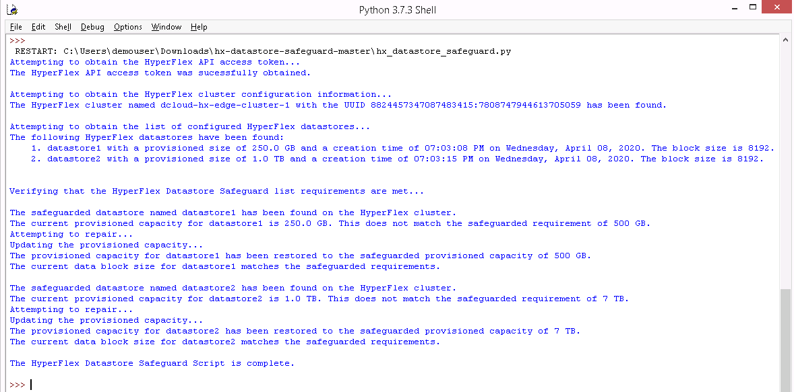
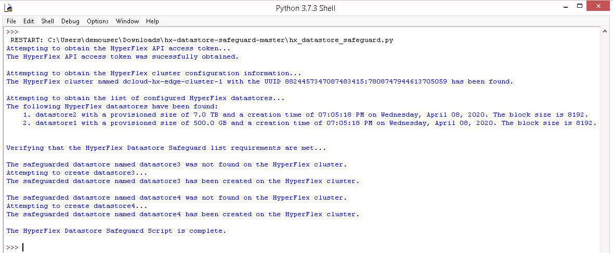
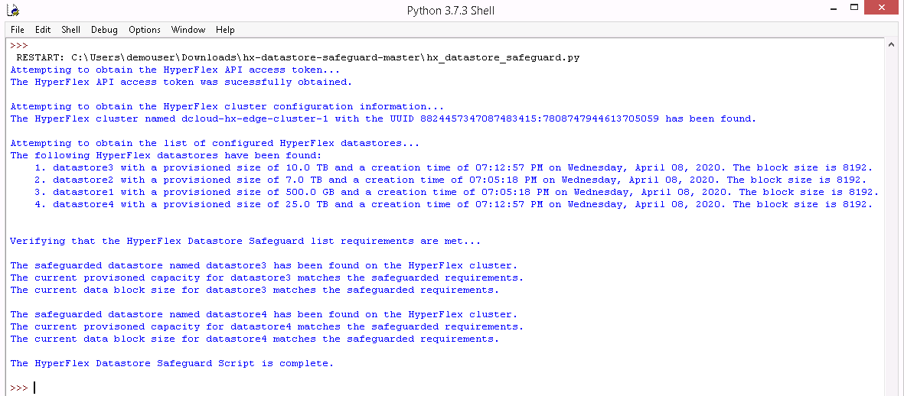

# Cisco HyperFlex Datastore Safeguard

[](https://developer.cisco.com/codeexchange/github/repo/ugo-emekauwa/hx-datastore-safeguard)

Cisco HyperFlex Datastore Safeguard for Cisco HyperFlex utilizes the HyperFlex API to automatically restore a targeted datastore's configuration if it is modified or deleted. If a specified datastore is deleted, it will be replaced. If a specified datastore's provisioned capacity size or block size is changed, the settings will be changed back to the original configuration.

This tool is intended for use on Cisco HyperFlex systems in demonstration or training environments. Do not use on production systems.

## Prerequisites:
1. Python 3 installed, which can be downloaded from [https://www.python.org/downloads/](https://www.python.org/downloads/).
2. Clone or download the Cisco HyperFlex Datastore Safeguard repository by using the  link on the main repository web page or by running the following command:
    ```
    git clone https://github.com/ugo-emekauwa/hx-datastore-safeguard
    ```
3. Install the required Python modules **requests** and **urllib3**. The requirements.txt file in the repository can be used by running the following command:
    ```
    python -m pip install -r requirements.txt
    ```
4. The IP address of the targeted Cisco HyperFlex system.
5. User credentials with administrative rights on the targeted Cisco HyperFlex system.
6. The name, capacity size and block size of any datastores on the targeted Cisco HyperFlex system that need the configuration safeguarded.

## Getting Started:
1. Please ensure that the above prerequisites have been met.
2. Download the **hx_datastore_safeguard.py** file from this repository here on GitHub.
3. Open the **hx_datastore_safeguard.py** file in an IDE or text editor.
4. Go to the comment section named **Required Variables**, as shown below:
    ```python
    ######################
    # Required Variables #
    ######################
    ```
5. Set the value of the variable named `hx_admin` with the username of the credentials that will be used to access the targeted Cisco HyperFlex system. The value must be a string. For example, here is an entry the sets the username to **admin**:
    ```python
    hx_admin = "admin"
    ```
6. Set the value of the variable named `hx_password` with the password of the credentials that will be used to access the targeted Cisco HyperFlex system. The value must be a string. For example, here is an entry that sets the password to **C1sco12345**:
    ```python
    hx_password = "C1sco12345"
    ```
7. Set the value of the variable named `hx_connect_ip` with the IP address of the targeted Cisco HyperFlex system. The value must be a string. For example, here is an entry that sets the IP address to **192.168.1.100**:
    ```python
    hx_connect_ip = "192.168.1.100"
    ```
8. Set the value of the variable named `hx_datastore_safeguard_list` by providing one or more dictionaries with the name, capacity size, capacity size unit and block size of any datastores that need the configuration safeguarded.
    For example, here is a sample entry with one dictionary for a datastore named datastore1 that has a capacity size of 500 GB and a block size of 4096:
    ```python
    hx_datastore_safeguard_list = ({"Name": "datastore1", "Size": 500, "SizeUnit": "GB", "BlockSize": 4096})
    ```
    Here is another example of a sample entry with two dictionaries for two datastores. The first dictionary is for a datastore named datastore1 that has a capacity size of 14 TB and a block size of 8192. The second dictionary is for a datastore named datastore2 that has a capacity size of 21 TB and a block size of 8192: 
    ```python
    hx_datastore_safeguard_list = ({"Name": "datastore1", "Size": 14, "SizeUnit": "TB", "BlockSize": 8192}, 
                                   {"Name": "datastore2", "Size": 21, "SizeUnit": "TB", "BlockSize": 8192})
    ```
    As shown in the preceding examples above, the dictionary for each datastore needs the following keys with values in the specified format:
    - `"Name"` - The datastore name provided as a string value.
    - `"Size"` - The datastore capacity size provided as an integer value.
    - `"SizeUnit"` - The datastore capacity size unit provided as a string value. The accepted values are:
        - "TB" for terabytes.
        - "GB" for gigabytes.
        - "B" for bytes.
    - `"BlockSize"` - The datastore block size provided as an integer value. The accepted values are:
        - 8192
        - 4096   
9. Save the **hx_datastore_safeguard.py** file. The file is now ready for use.

## How to Use (w/ Examples):

1. After fulfilling the requirements listed in the [**Prerequisites**](https://github.com/ugo-emekauwa/hx-datastore-safeguard#prerequisites) and [**Getting Started**](https://github.com/ugo-emekauwa/hx-datastore-safeguard#getting-started) sections, run **hx_datastore_safeguard.py** directly from your IDE or from the command line e.g.:
    ```
    python hx_datastore_safeguard.py
    ```
2. Here is an example of the output from **hx_datastore_safeguard.py** if no safeguarded datastores have been set yet.

    

    All of the available datastores on the targeted HyperFlex cluster are listed with information regarding the size, creation time and block size. None of the datastores have been safeguarded yet.

3. Here is an example of the output from **hx_datastore_safeguard.py** after safeguarding datastore1 and datastore2 in the file and the current configuration of the datastores on the targeted HyperFlex cluster do not match the safeguard settings. Datastore1 has been safeguarded with settings that enforce 500 GB and a block size of 8192. Datastore2 has been safeguarded with settings that enforce 7 TB and a block size of 8192.

    

    After the available datastores on the targeted HyperFlex cluster are listed, the configuration of datastore1 and datastore2 are updated to match the safeguarded settings of 500 GB and 7 TB respectively. Safeguarding datastore1 and datastore2 with the settings above is done with the following entries in hx_datastore_safeguard_list:
    ```python
    hx_datastore_safeguard_list = ({"Name": "datastore1", "Size": 500, "SizeUnit": "GB", "BlockSize": 8192}, 
                                   {"Name": "datastore2", "Size": 7, "SizeUnit": "TB", "BlockSize": 8192})
    ```

    If **hx_datastore_safeguard.py** is executed again after the safeguarded datastores have been corrected, no changes are made as shown below.

    

4. Here is an example of the output from **hx_datastore_safeguard.py** if safeguarded datastores are missing from the targeted HyperFlex cluster.

    

    Safeguarding datastore3 and datastore4 with the settings above is done with the following entries in hx_datastore_safeguard_list:
    ```python
    hx_datastore_safeguard_list = ({"Name": "datastore3", "Size": 10, "SizeUnit": "TB", "BlockSize": 8192}, 
                                   {"Name": "datastore4", "Size": 25, "SizeUnit": "TB", "BlockSize": 8192})
    ```

    If **hx_datastore_safeguard.py** is executed again after the safeguarded datastores have been added, no changes are made as shown below.

    

## Author:
Ugo Emekauwa

## Contact Information:
uemekauw@cisco.com or uemekauwa@gmail.com
